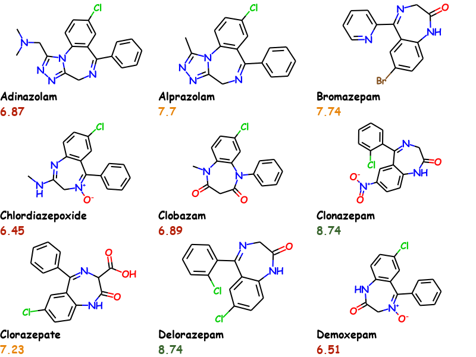

# RDKit Molecule Slide Generator

RDKit Molecule Slide Generator is a tool for generating an overview image of molecules and their properties for usage in reports, presentations or blogs. An advanced `MolsToGridImage`. It's easier to show than explain.



This example uses the first 9 molecules of the `bzr.sdf` in the RDKit distributions data directory and uses Comic Sans MS as font. Activity values are conditionally colored.

### Why should I use it?

Traditional reporting tools could also be used to generate a similar output however the problem with these is that the information especially the chemical structure is then lost as it could only be restored via optical structure recognition. This can be avoided by using commercial tools like ChemDraw but it does not offer any automated way to generated such documents out-of-the-box and you are locked-in.

Molecule Slide Generator can be used in an automated fashion via web application or say a python script in KNIME. The generated images contain all the chemical structures in different formats and the properties inside the images metadata. This data can be extracted again without the need for RDKit (albeit RDKit makes it easier if available). So you get an automated, vendor agnostic solution.

The images can also be sent by email (tested with gmail) or used in blogs and websites.

### Installation

##### Requirements

- RDKit 2020.09.1 or higher
- numpy
- pillow

##### New conda environment

For installation into a new conda environment, please use the included `environment.yml` file:

```bash
conda env create -f environment.yml
```

This takes care of all dependencies and is the suggested way to try it out.

##### Existing environment

To install into an existing environment, please ensure the needed requirements are already installed as the install script does not verify them.

```bash
pip install git+https://github.com/kienerj/molecule-slide-generator
```

### Features

- Any true type font (.ttf) can be used for the atom labels and text. 
- Set font size of atom labels and text
- The text can be colored separately for each molecule and property
- Set bond length of molecule (`fixedBondLength`drawing option)
- Molecules are rescaled to RDKits default bond length so that all of them have the same size
- The property can be displayed with or without the properties name
- Define size of slide (width, height) and number of rows and columns 
- Molecule data and properties are stored in images metadata and can be extracted again

### Example Code

This is the code used to generate above image on Windows. For Linux you would have to use a different font or install MS Core fonts.

```python
from rdkit import Chem
from rdkit.Chem import AllChem,Draw
from molecule_slide_generator import *

suppl = Chem.SDMolSupplier('tests/bzr21.sdf')
# first 9 mols
mols = [x for x in suppl][:9]

# Create properties with coloring
all_props = []
for mol in mols:    
    AllChem.Compute2DCoords(mol) # remove 3D coords
    a = float(mol.GetProp('ACTIVITY'))
    if a > 8.0:
        color = '#3A662F'
    elif a < 8.0 and a > 7:
        color = '#e8860e'
    else:
        color = '#b52009'
    props = [TextProperty('Name', mol.GetProp('_Name')), 
             TextProperty('Activity', a, color=color)]
    all_props.append(props)
    
# Generate the slide
sg = SlideGenerator(mols_per_row=3, rows=3, font_size=18, font='comicbd', 
                    number_of_properties=2, slide_width=800, slide_height=600)
png = sg.generate_slide(mols, all_props, 'example_slide.png')
```

For font you can either use a named font or a full path to a `.ttf` file. For named fonts the font must be in `C:/Windows/Fonts/` directory for Windows and for Linux in `/usr/share/fonts/truetype`.


### Extracting

Data can be extracted either manually or with the provided `DataExtractor` tool.

#### Manually

Molecules and properties can be extracted "manually" using the according RDKit functionality:

```python
mols = Chem.MolsFromPNGString(png)
Draw.MolsToGridImage(mols,molsPerRow=3)
```

where `png`is a bytes object containing the png data.

For properties you can see the available data also by using RDKit:

```python
nprops = Chem.MetadataFromPNGString(png)
nprops.keys()
dict_keys(['rdkitPKL rdkit 2020.09.1', 'MOL rdkit 2020.09.1', 'SMILES rdkit 2020.09.1', 'Name', 
           'Activity', 'rdkitPKL1 rdkit 2020.09.1', 'MOL1 rdkit 2020.09.1', 'SMILES1 rdkit 2020.09.1', 
           'Name1', 'Activity1', 'rdkitPKL2 rdkit 2020.09.1', 'MOL2 rdkit 2020.09.1', 
           'SMILES2 rdkit 2020.09.1', 'Name2', 'Activity2', 'rdkitPKL3 rdkit 2020.09.1', 
           'MOL3 rdkit 2020.09.1', 'SMILES3 rdkit 2020.09.1', 'Name3', 'Activity3', 
           'rdkitPKL4 rdkit 2020.09.1', 'MOL4 rdkit 2020.09.1', 'SMILES4 rdkit 2020.09.1', 'Name4', 
           'Activity4', 'rdkitPKL5 rdkit 2020.09.1', 'MOL5 rdkit 2020.09.1', 'SMILES5 rdkit 2020.09.1', 
           'Name5', 'Activity5', 'rdkitPKL6 rdkit 2020.09.1', 'MOL6 rdkit 2020.09.1', 
           'SMILES6 rdkit 2020.09.1', 'Name6', 'Activity6', 'rdkitPKL7 rdkit 2020.09.1', 
           'MOL7 rdkit 2020.09.1', 'SMILES7 rdkit 2020.09.1', 'Name7', 'Activity7', 
           'rdkitPKL8 rdkit 2020.09.1', 'MOL8 rdkit 2020.09.1', 'SMILES8 rdkit 2020.09.1', 'Name8', 
           'Activity8'])
```

The system used is that first molecules data is in key with the properties name, eg. "Activity" in the example. For each subsequent molecule the index of the molecule in the file is appended. So to get the activity value for the second molecule in the image you would use the key "Activity1". Data is returned as bytes and must be converted accordingly.

```python
float(nprops['Activity1'].decode('utf-8'))
7.7
```

#### Data Extractor

The molecules and properties can be extracted again from the images by using the `DataExtractor`.

``````python
extractor = DataExtractor()
df = extractor.extract_single("images/example_slide_bzr.png")
``````

This will return a `pandas.DataFrame` containing all the molecules and stored properties.

`DataExtractor` can also be called in a loop using multiple calls to `extractor.extract(image)` and finally calling `df = extractor.get_data()` to return the data from multiple images in a single data frame.

#### Extracting from MS Word or PowerPoint

If you insert the image into an MS Office document, it can get problematic to extract the original image with all the metadata. However looking at the document contents (thanks to Greg for this hint), the original images are present and can be extracted again. For extracting all the molecules in an MS Office document you can use the KNIME component [Extract RDKit Molecules From Office](https://hub.knime.com/kienerj/spaces/Public/latest/Extract%20RDKit%20Molecules%20From%20Office). Alternatively you can manually or programmatically unzip the office document and use `DataExtractor` to iterate over the contained png images.

### Miscellaneous

The default parameters of the slide generator work well with small molecules and a PowerPoint template with an aspect ratio of 16:9 that has a title and subtitle text box, the specific setup I have to use. You will need to play with the parameters to find an good solution for your specific needs.

Technically the generator creates a molecule image using RDKit and a separate image with the text (properties) and merges them. Then all these images get merged together into the final image to which the metadata is appended. For all this "image manipulation" `pillow` is used.